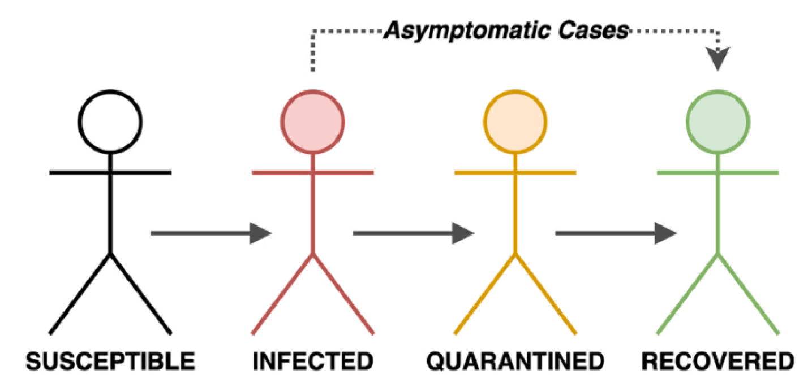
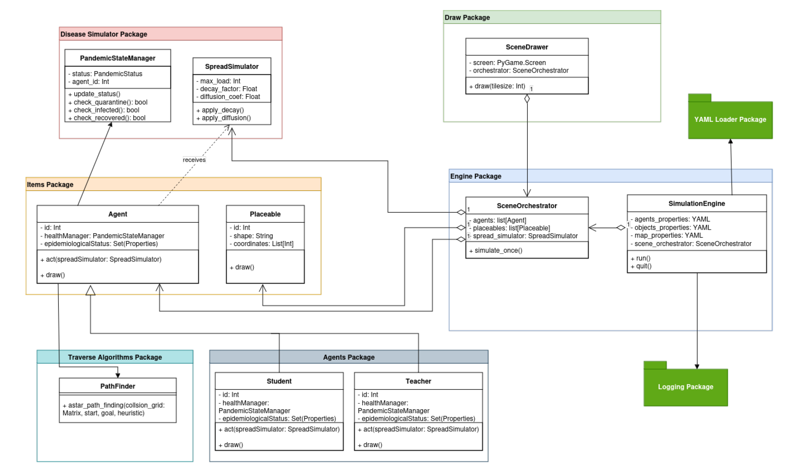
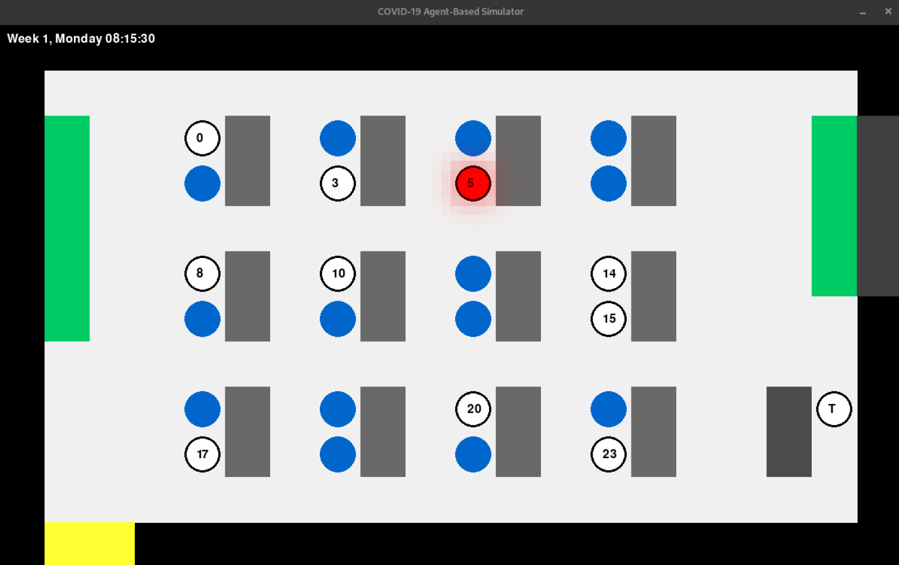
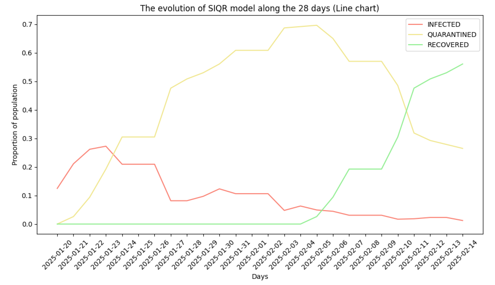
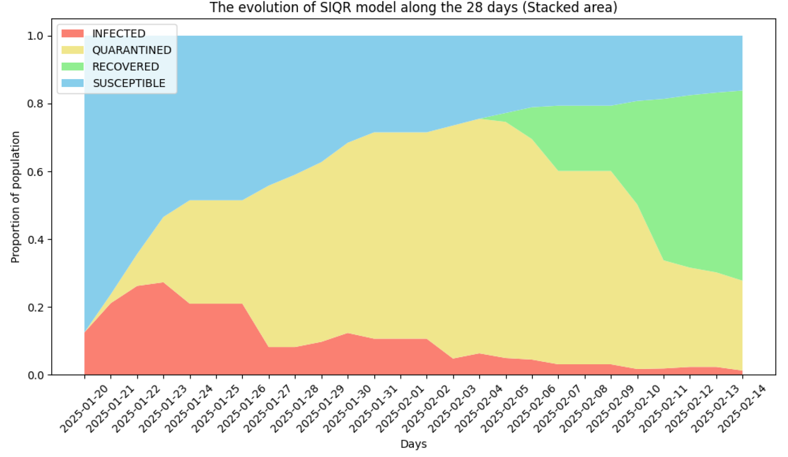

# Implementation of an Agent-Based Epidemiological Model for School Environments

## 1. Introduction

This project aims to simulate the spread of COVID-19 in a classroom environment
using an agent-based model. By modeling the interactions between students and teachers,
the simulation provides insights into the dynamics of virus transmission within educational
settings and reflects on the broader impact of COVID-19 on the health and safety of
individuals in such environments.

By combining these elements, this project seeks to achieve the following objectives:
- **Modeling transmission dynamics**: Simulating how individual interactions and
viral particle spread contribute to the risk of infection.
- **Analyzing intervention strategies**: Examining the impact of preventive measures
such as masks, vaccination, and quarantine protocols.
- **Visualizing the epidemic evolution**: Providing graphical representations of infection
progression and population state transitions.

The article will cover the methodologies used in the project, including the implementation
of agent behaviors, pandemic state management, and viral particle diffusion. It
will also discuss the insights gained from simulations, the challenges encountered, and
potential extensions for more advanced modeling scenarios.

## Installation and Setup

To replicate and test the model, start by cloning the project repository from GitHub:

```bash
git clone https://github.com/dey44and/disease-simulator
cd disease_simulator
```

**Create a virtual environment**: Set up a Python virtual environment to manage dependencies.

```bash
python -m venv venv
source venv/bin/activate
```

**Install the dependencies**: Install all Python libraries using the requirements.txt file.

```bash
pip install -r requirements.txt
```

**Run the simulator**: Execute the main script to start the simulation engine.

```bash
python main.py
```

## 2. Epidemiological Model

In this section, we describe the components of the epidemiological model implemented
in our simulation. The model is designed to simulate the spread of COVID-19 among
agents, incorporating individual behavior, protective measures, and disease evolution.

### 2.1 Agents and Their Properties

Agents are the primary entities in the simulation, representing students and a teacher.
Each agent has a unique identifier, schedule, style, behavior, mask type, and vaccine type.
These attributes influence the agent’s interaction with the environment and susceptibility
to infection.

- **Schedule**: Specifies the agent’s arrival and departure times.
- **Style**: Defines the agent’s overall risk-taking behavior (lazy, neutral, or smart).
- **Behavior**: Indicates the activity level (quiet or active).
- **Mask**: Describes the type of mask used (no-mask, cloth, surgical, n95).
- **Vaccine**: Specifies the vaccine type (no-vax, any, astra-zeneca, pfizer/moderna).

The agent configuration is provided through a YAML file.

### 2.2 Simulation Engine

The simulation engine orchestrates the overall execution of the model by managing several
critical components:

- Time Management: The simulation operates on discrete time steps, where each
step represents a specific ratio between real-world seconds and simulated seconds.

- **Spatial Resolution**: The spatial resolution of the environment is controlled by:
  - Map Density: This parameter defines the number of tiles in the simulation
  map, directly affecting the complexity of the environment. 
  - Grid Density: This parameter determines the granularity of particle modeling
  within each tile.
- **Virus Spread Parameters**: Several parameters govern how virus particles are
  modeled and evolve within the simulation:
  - Base Shedding: This parameter specifies the number of virus particles emitted
  by an infectious agent per second.
  - Decay Constant: This parameter controls the rate at which virus particles
  decay over time, simulating the natural degradation of airborne particles. 
  - Diffusion Coefficient: This parameter dictates the rate at which virus particles
  spread to neighboring cells. 

```bash
engine :
    start_time : " 07:30:00 "
    end_time : " 14:00:00 "
    infection_prob : 0.021
    num_weeks : 4
    time_step_seconds : 5
    map_density : 1
    grid_density : 5
    max_load : 16000
    decay_const : 0.0007
    diffusion_coeff : 0.02
    base_shedding : 40
```

### 2.3 Spread Simulator

The **SpreadSimulator** is a core component of the simulation framework, designed to model the distribution, infection, and decay of viral particles within the environment. It operates on a grid-based representation of the simulation area, where each cell maintains a numerical value representing the viral load.

The environment is represented as a 2D grid system, with each cell corresponding to a specific location in the environment. Each cell is updated at regular intervals to reflect the decay and spread of viral particles. The grid-based approach is beneficial for computational efficiency, as well as ease of representation and manipulation. Each cell stores a numerical value that represents the concentration of viral particles.

The model ensures that viral particles diffuse from high concentration to low, with the rate of diffusion determined by the difference in concentration. The parameter for particle diffusion was calibrated using official data to maintain both realism and scientific validity.

### 2.4 Health Manager
The PandemicStateManager class is responsible for tracking and managing the health
status of each agent throughout the simulation.
The health states include:
- **Susceptible**: The agent is healthy but at risk of infection based on environmental
exposure and interactions.
- **Infected**: The agent has contracted the virus and may be shedding particles into
the environment.
- **Quarantined**: The agent is isolated due to symptoms or a positive test result and
does not interact with the environment.
- **Recovered**: The agent has overcome the infection and is immune to re-infection
for the duration of the simulation.

#### 2.4.1 Transitions Between States
The transitions between health states are governed by key epidemiological factors:
1. **Infection**: Susceptible agents may transition to the infected state based on exposure
to viral particles in their vicinity. The risk of infection is modulated by mask
efficiency and vaccination status.
2. **Pre-symptomatic Phase**: Infected agents initially enter a pre-symptomatic phase
during which they are infectious but exhibit no symptoms.
3. **Symptomatic Phase**: Upon the onset of symptoms, agents remain in the infected
state until the end-of-day testing leads to quarantine.
4. **Quarantine**: Symptomatic agents are quarantined for 14 days to prevent further
interactions.
5. **Recovery**: Quarantined agents transition to the recovered state after completing
their isolation period.



#### 2.4.2 Duration Modeling

The durations of each phase are sampled from Gamma distributions to reflect the variability
in real-world epidemiological timelines. The following table summarizes the
parameters used:

| Phase              | Mean Duration (days) | 
|--------------------|----------------------|
| Incubation (total) | 5.2                  |
| Pre-symptomatic    | 2.3                  |
| Symptomatic        | 3.2                  |

At the end of each simulation day, symptomatic agents are tested and quarantined if
necessary. Quarantine ensures agents do not interact with the environment or contribute
to viral shedding. Recovery is determined by the completion of the quarantine period.
The _PandemicStateManager_ integrates seamlessly with other simulation components,
enabling realistic modeling of disease progression, infectiousness, and mitigation measures.

### 2.5 Pathfinding with the A* Algorithm

The simulation employs the A* algorithm to model agent movement within the environment.
The A* algorithm is a popular pathfinding and graph traversal technique that
guarantees an optimal path if one exists. It is widely used in applications requiring
real-time decision-making due to its efficiency and accuracy.

The A* algorithm operates by evaluating potential paths based on a cost function:

f(n) = g(n) + h(n)

where:
- g(n): The cost of the path from the starting point to the current node n.
- h(n): The heuristic estimate of the cost to reach the goal from node n.

By combining the actual cost g(n) and the heuristic h(n), the algorithm balances
exploration of the shortest path while maintaining computational efficiency.
Agents in the simulation use the A* algorithm to navigate between locations, such
as desks, entrances, and hotspots. The map is represented as a grid, where each tile
corresponds to a node in the graph. The algorithm considers the following:
- **Grid Density**: Higher grid density increases the granularity of the movement
model, allowing more precise pathfinding.
- **Collision Handling**: Nodes that correspond to obstacles or other agents are
marked as impassable.
- **Heuristic Function**: A Manhattan distance heuristic is used to estimate the cost
to the target node, depending on the environment’s properties.

## 3. Implementation

**Python** was chosen for its simplicity, readability, and extensive library support. Its
suitability for agent-based modeling and integration with Pygame makes it an excellent choice for this simulation. **Pygame**, a lightweight game development library, is used for
rendering agents and virus particles in a 2D environment, managing user interactions and
simulation dynamics, and providing real-time visual feedback to enhance understanding
of the epidemiological model.



### 3.1 Map Construction and Flexibility

The simulation environment is constructed as a grid-based map, allowing for a flexible
and customizable setup. Each component of the environment is defined with attributes
such as position, size, color, and geometry. This modular approach ensures that the
simulation engine is not constrained to a specific scenario and can be adapted to various
configurations and densities.

The map’s layout is defined by a configuration file, where each component is specified
with key attributes:
- **Type**: Specifies the object type (e.g., table, chair).
- **Position**: Defines the _x_ and _y_ coordinates of the object in the grid.
- **Dimensions**: Includes attributes like width and height for rectangular objects.
- **Color**: Indicates the RGB color of the object.
- **Geometry**: Defines the shape of the object (e.g., rectangle, circle).
- **Collision**: Specifies whether the object blocks movement.

### 3.2 Example Configuration

In this example, the table occupies a rectangular area at position (5, 5), with dimensions
1 × 2, while the chair is represented as a circular object at (4, 5). 

```bash
- type : Table
  x: 5
  y: 5
  width : 1
  height : 2
  color : [105 , 105 , 105]
  collision : True
  geometry : rectangle
- type : Chair
  x: 4
  y: 5
  color : [0, 102 , 204]
  geometry : circle
```

The design of the map construction system ensures that the simulation engine is not
limited to a single predefined scenario. By modifying the configuration file, users can
recreate various real-world environments, such as classrooms, offices, or open spaces, with
minimal effort. This flexibility makes the engine highly adaptable for studying the spread
of diseases in different settings.

## 4. Experiments and Results

The simulation was conducted to model the spread of COVID-19 in a classroom environment
over a period of 4 weeks. Each simulation day represents 6 hours of classroom
activity, during which agents interact and move within the defined map structure. The
participants in the simulation include 10 students and 1 teacher, with varying characteristics
that influence their behavior and risk of infection.

### 4.1 Agent Behavior Definitions

To provide diversity in behavior and simulate realistic interactions, each agent is assigned
specific behavioral and cognitive traits, as detailed below:

- **Quiet**: Agents with a quiet behavior exhibit minimal movement and interaction.
These agents tend to remain seated or in close proximity to their assigned areas,
reducing their exposure to viral particles.
- **Active**: Agents with an active behavior frequently move around the classroom,
interact with other agents, and occupy different zones. This increases their likelihood
of encountering infected particles in the environment.
- 


### 4.2 Simulation Setup

The simulation environment is designed to mimic a typical classroom setting, with the
following parameters:
- **Participants**: 10 students and 1 teacher, each with unique behavioral and cognitive
traits.
- **Duration**: Each simulation day consists of 6 hours of activity. The simulation is
run for 4 weeks (28 days).
- **Environment**: The classroom is represented as a grid, where agents move and interact
with objects like desks and chairs. The grid density influences the granularity
of viral particle modeling.
- **Virus Spread**: The spread of viral particles is governed by parameters such as base
shedding rate, decay constant, and diffusion coefficient, ensuring realistic modeling
of airborne transmission.
- **Preventive Measures**: Each agent is assigned a specific type of mask and vaccination
status, which influence their infection risk.

The results indicate that agents using N95 masks and those vaccinated with Pfizer/Moderna
generally experienced lower infection rates. However, agents who were more active
exhibited higher infection probabilities, regardless of their protective measures. Notably,
the teacher (Agent -1) exhibited one of the highest infection rates, likely due to their
prolonged exposure in the environment and interaction patterns.

The simulation also demonstrates the impact of the SIQR model parameters on infection
dynamics. The quarantine measures effectively reduce the proportion of infected
agents over time, leading to a gradual increase in recovered individuals. Quarantine measures
played a significant role in limiting the spread of infection during the simulation.
By isolating symptomatic agents at the end of each day, the number of actively infectious
agents present in the environment was significantly reduced.





## References

[1] World Health Organization, “Coronavirus disease (covid-19) pandemic,”
https://www.who.int/emergencies/diseases/novel-coronavirus-2019, 2023, accessed:
2025-01-15.

[2] P. Ciunkiewicz, W. Brooke, M. Rogers, and S. Yanushkevich, “Agent-based epidemiological
modeling of covid-19 in localized environments,” Schulich School of Engineering,
2020, department of Biomedical Engineering and Department of Electrical and
Computer Engineering.

[3] C. MacIntyre and A. Chughtai, “A rapid systematic review of the efficacy of face masks
and respirators against coronaviruses and other respiratory transmissible viruses for
the community, healthcare workers and sick patients,” International Journal of Nursing
Studies, vol. 108, p. 103629, 2020.

[4] J. L. Bernal, N. Andrews, C. Gower, E. Gallagher, R. Simmons, S. Thelwall, J. Stowe,
E. Tessier, N. Groves, G. Dabrera, R. Myers, C. Campbell, G. Amirthalingam, M. Edmunds,
M. Zambon, K. Brown, S. Hopkins, M. Chand, and M. Ramsay, “Effectiveness
of covid-19 vaccines against the b.1.617.2 (delta) variant,” New England Journal of
Medicine, vol. 385, pp. 585–594, 2021.

[5] V. Vuorinen, M. Aarnio, M. Alava, V. Alopaeus, N. Atanasova, M. Auvinen, N. Balasubramanian,
H. Bordbar, P. Er¨ast¨o, R. Grande, N. Hayward, A. Hellsten, S. Hostikka,
J. Hokkanen, O. Kaario, A. Karvinen, I. Kivist¨o, M. Korhonen, R. Kosonen, J. Kuusela,
S. Lestinen, E. Laurila, H. J. Nieminen, P. Peltonen, J. Pokki, A. Puisto,
P. R˚aback, H. Salmenjoki, T. Sironen, and M. ¨ Osterberg, “Modelling aerosol transport
and virus exposure with numerical simulations in relation to sars-cov-2 transmission
by inhalation indoors,” Environment International, vol. 141, p. 105792, 2020.

[6] T. N. Vilches, S. Nourbakhsh, K. Zhang, L. Juden-Kelly, L. E. Cipriano, J. M. Langley,
P. Sah, A. P. Galvani, and S. M. Moghadas, “Multifaceted strategies for the
control of covid-19 outbreaks in long-term care facilities in ontario, canada,” Journal
of Theoretical Biology, vol. 528, p. 110865, 2021.

[7] P. Community, “Pygame - a set of python modules designed for writing video games,”
https://github.com/pygame/pygame, 2025, accessed: 2025-01-15.